Лабораторная работа 4.  
====
# Немного информации о цели лабараторной работы
Исследовать влияние различных техник аугментации данных на процесс обучения нейронной сети на примере решения задачи классификации Oregon Wildlife с использованием техники обучения Transfer Learning. В данной работе использовалась нейронная сеть EfficientNet-B0, предобученная  на базе изображений ImageNet с использованием политики изменения темпа обучения - Экспоненциальное затухание (Exponential Decay) с параметрами initial_lrate = 0.01 и k = 0.25. 

Аугментация данных — это важный этап обучения моделей машинного обучения. Под аугментацией данных понимается увеличение выборки данных для обучения через модификацию существующих данных.

В данной лабораторной работе использовались техники аугментации данных:
 -Манипуляции с яркостью и контрастом
 -Поворот изображения на случайный угол
 -Использование случайной части изображения
 -Добавление случайного шума
 
 * Для упрощения анализа результатов, будем сравнивать их с резульататми полученными при обучении нейронной сети EfficientNet-B0 без аугментации данных.
 
  ### Графики обучения для предобученной нейронной сети EfficientNet-B0 с политикой изменения темпа обучения - экспоненциальное затухание
 

 ***График метрики точности:*** 
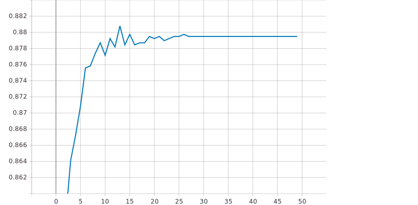

 ***График функции потерь::*** 
 
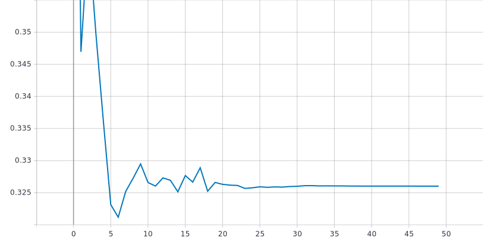

### Анализ результатов:
- точности в конце обучения = 87.95%
- значение потерь в конце обучения = 0.326
 

# С использованием техники обучения Transfer Learning и оптимальной политики изменения темпа обучения обучить нейронную сеть EfficientNet-B0 (предварительно обученную на базе изображений imagenet) для решения задачи классификации изображений Oregon WildLife с использованием следующих техник аугментации данных:
 
### Манипуляции с яркостью и контрастом

* Функции изменения контраста, где image - входное изображение, 0.5  - множитель для регулировки контраста (contrast_factor).
```
def contrast(image, label):  
  return tf.image.adjust_contrast(image, 0.5), label
```

* Функции изменения яркости, где image - входное изображение, delta = 0.1  - число добавляемое к значениям пикселей.
```
def brightness(image, label):
  return tf.image.adjust_brightness(image, delta=0.1),label
```

* Вызов функции производился в TFRecordDataset:
```
return tf.data.TFRecordDataset(filenames)\
    .....
    .map(contrast)\
    .map(brightness)\
    ....

```

* Использовались следующии параметры:
```
  contrast_factor = 0.5, delta = 0.5;
  contrast_factor = 2, delta = 0.1;
  contrast_factor = 2, delta = 0.25;
  contrast_factor = 2, delta = 0.5;
  contrast_factor = 4, delta = 0.1;
```

 ### Графики обучения для предобученной нейронной сети EfficientNet-B0 с манипуляции с яркостью и контрастом:
  
 ***График метрики точности:*** 
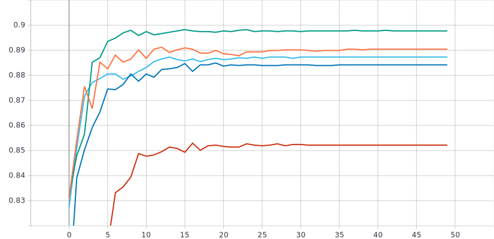

***Пояснение:*** 
 
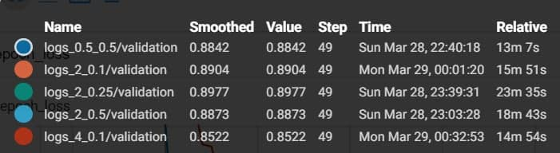

 ***График функции потерь:*** 
 
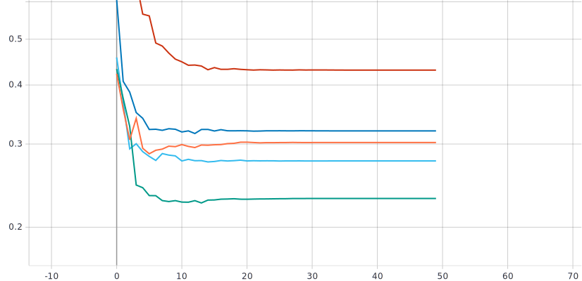

 ***Пояснение:*** 
 
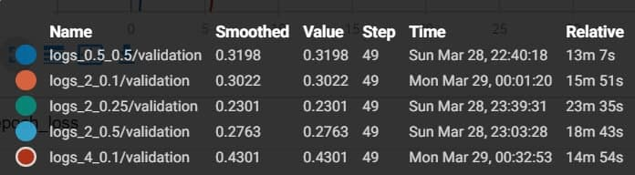


### Анализ результатов:
Исходя из графкиов можно сказать, что параметры contrast_factor = 2, delta = 0.25 - являются оптимальными. 
При использовании данных параметров удалось добиться значения точности равное 89.77%, значение функции потерь равное 0.2301.
По сравнению с политикой без аугментации данных:
- Увеличелось значение точности на 1,82%
- уменьшение значение функции потерь на 0,0959

### Поворот изображения на случайный угол

* Для поворота изображения на случайный угол  в архитектуру нейронной сети был добавлен следующий слой с параметром factor=(0, 0.25) - определяет диапазон из которого будет случайно выбран угол поворота. 
```
 x = tf.keras.layers.experimental.preprocessing.RandomRotation(factor=(0, 0.25))(inputs)
```


* Использовались следующии параметры:
```
  factor = (0, 0.5);
  factor = (0, 0.25);
  factor = (0, 0.1);
  factor = (0, 0.05);
  factor = (0, 0.025);
  factor = (0, 0.001);
```

 ### Графики обучения для предобученной нейронной сети EfficientNet-B0 с поворотом на случайный угол:
  
 ***График метрики точности:*** 
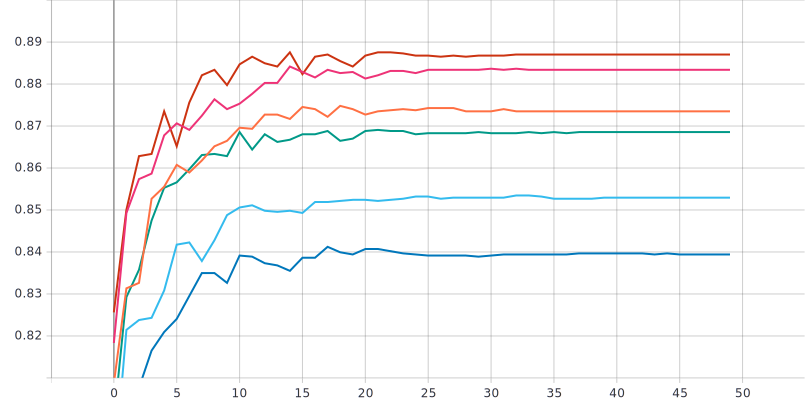

***Пояснение:*** 
 
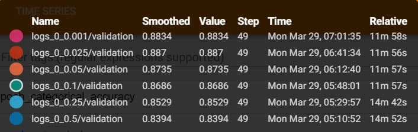

 ***График функции потерь:*** 
 
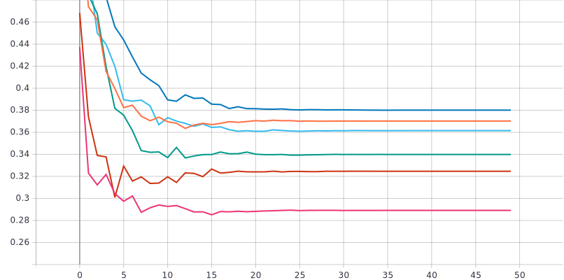

 ***Пояснение:*** 
 
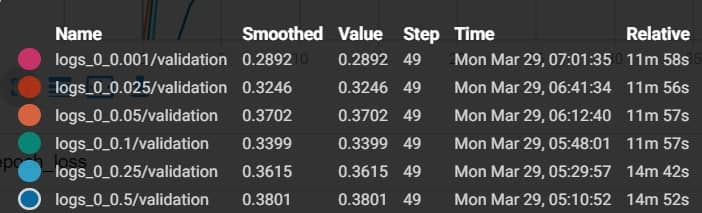


### Анализ результатов:
Исходя из графкиов можно сказать, что при использовании параметров factor = (0, 0.025) и factor = (0, 0.001) достигаются лучшие значения.
При использовании factor = (0, 0.025) удалось добиться значения точности равное 88.70%, значение функции потерь равное 0.3246.
При использовании factor = (0, 0.001) удалось добиться значения точности равное 88.34%, значение функции потерь равное 0.2892.
Но так как во втором случае слишком маленький угол поворота (меньше одного градуса), то будет считать factor = (0, 0.025) - оптимальными параметрами.
По сравнению с политикой без аугментации данных:
- Увеличелось значение точности на 0,75%
- уменьшение значение функции потерь на 0,0014

### Влияние режимов заполнения для поворота изображения на случайный угол

* Для поворота изображения на случайный угол  в архитектуру нейронной сети был добавлен следующий слой с параметрами factor=(0, 0.25) - определяет диапазон из которого будет случайно выбран угол поворота, fill_mode = 'nearest' - режим заполнения.
```
 x = tf.keras.layers.experimental.preprocessing.RandomRotation(factor=(0, 0.25), fill_mode = 'nearest')(inputs)
```


* Использовались следующии режимы:
```
 fill_mode = 'nearest'
 fill_mode = 'constant'
 fill_mode = 'wrap'
 fill_mode = 'reflect
```

 ### Графики обучения для предобученной нейронной сети EfficientNet-B0 с манипуляции с яркостью и контрастом:
  
 ***График метрики точности:*** 
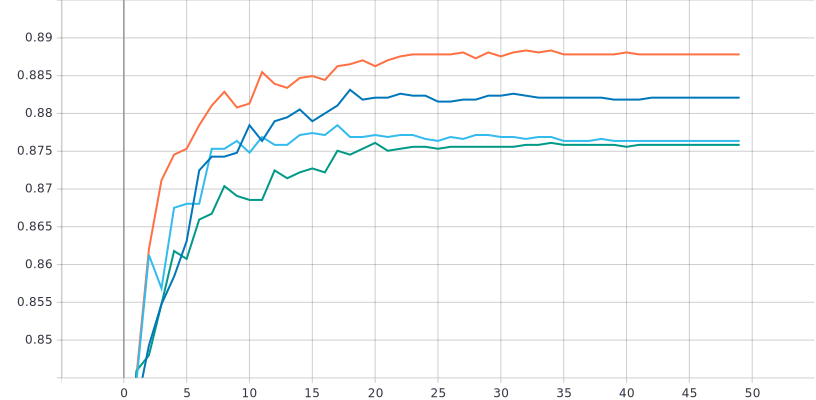

***Пояснение:*** 
 
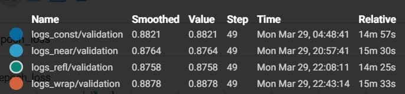

 ***График функции потерь:*** 
 
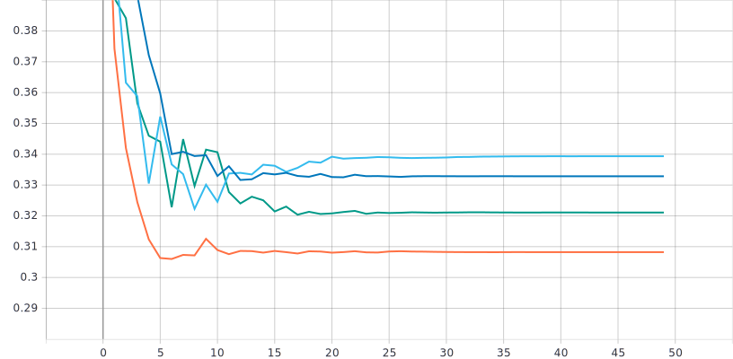

 ***Пояснение:*** 
 
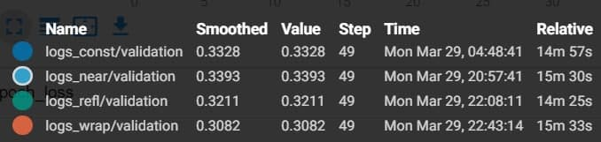


### Анализ результатов:
Исходя из графкиов можно сказать, что при использовании параметров factor = (0, 0.025) и factor = (0, 0.001) достигаются лучшие значения.
При использовании factor = (0, 0.025) удалось добиться значения точности равное 88.70%, значение функции потерь равное 0.3246.
При использовании factor = (0, 0.001) удалось добиться значения точности равное 88.34%, значение функции потерь равное 0.2892.
Но так как во втором случае слишком маленький угол поворота (меньше одного градуса), то будет считать factor = (0, 0.025) - оптимальными параметрами.
По сравнению с политикой без аугментации данных:
- Увеличелось значение точности на 0,75%
- уменьшение значение функции потерь на 0,0014

- точности в конце обучения = 87.95%
- значение потерь в конце обучения = 0.326
